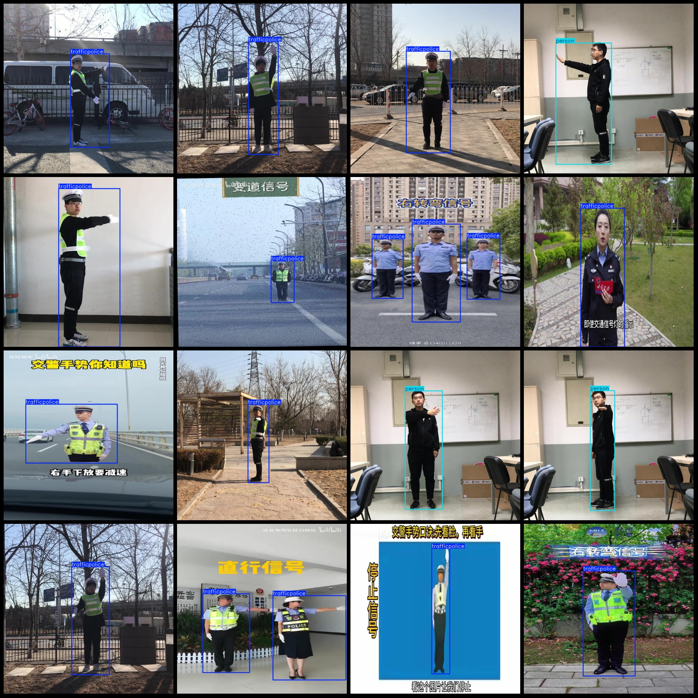
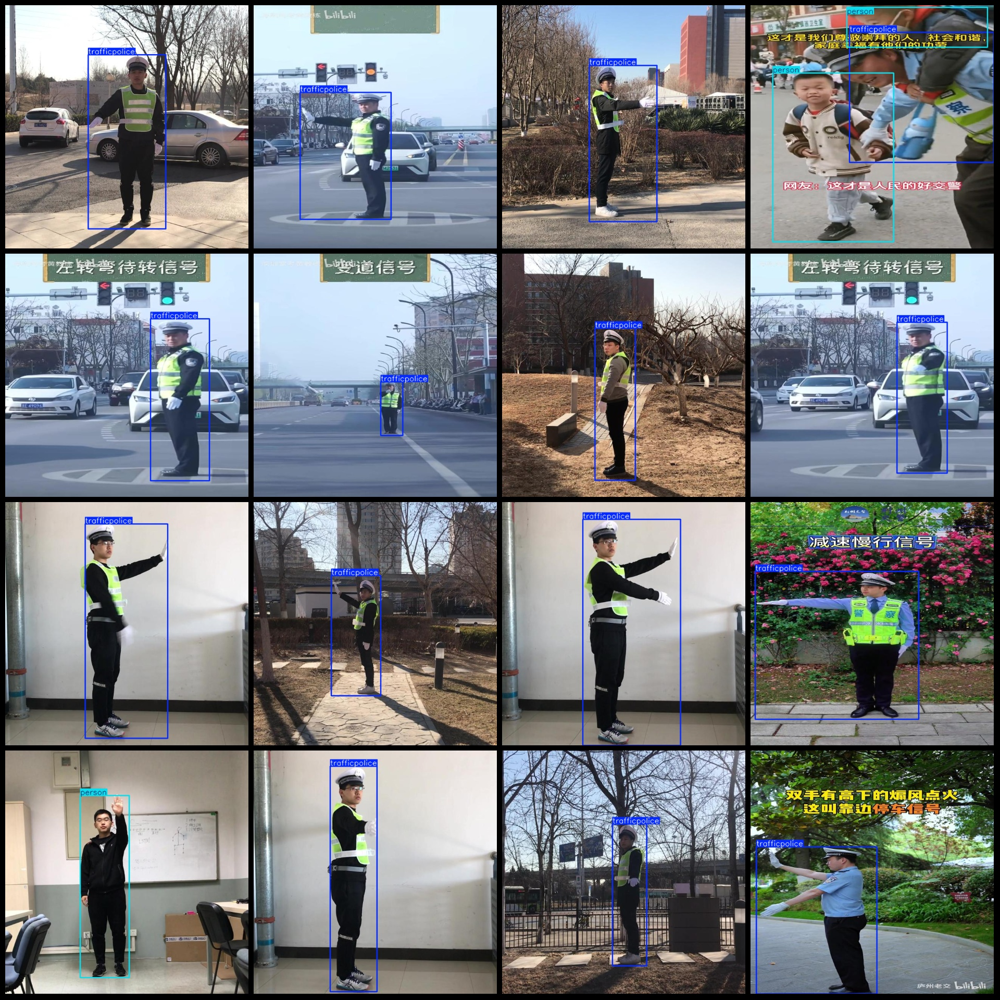

# Wisdom Traffic Police and Non-Police Detection Dataset VOC+YOLO Format with 2277 Images in 2 Categories

Please note that the dataset contains multi-segment video clips, resulting in many duplicate images (actually unique MD5 values for each image). Please review the images carefully.
The dataset format includes Pascal VOC format + YOLO format (without split path txt files, only including jpg images along with their corresponding VOC format xml files and YOLO format txt files).
Number of images (jpg file count): 2277
Number of labeled files (xml file count): 2277
Number of labeled files (txt file count): 2277
Number of labeled categories: 2
Labeled category names (please note that the order of labels in the YOLO format does not match this, but is based on the "labels" folder's "classes.txt" file): ["person", "trafficpolice"]
Number of bounding boxes per category:
Person bounding boxes = 498
Traffic police bounding boxes = 2492
Total bounding boxes = 2990
Number of images per category:
Person images = 445
Traffic police images = 1872
Image resolution: 640x640
Annotation tool used: labelImg
Annotation rules: drawing bounding boxes for categories
Important notice: The dataset does not have been divided into training, validation, or test sets. You are required to do so yourself.
Special declaration: This dataset does not guarantee the precision of models or weight files trained on it.
Image preview:
Annotation example:

## Image

Here is a pay link on Stripe ( https://buy.stripe.com/3cs8yP7sY87d0vu9AB ). Please contact me lonlonago@foxmail.com after funding $89, and I will send you a complete data files , thank you!

